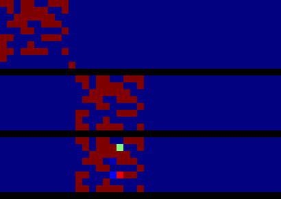
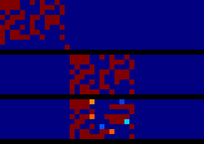
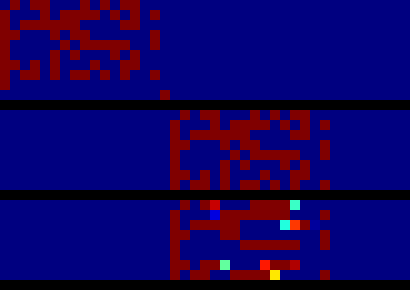
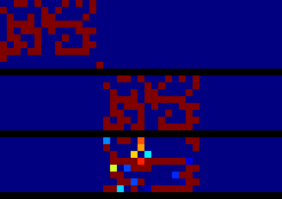
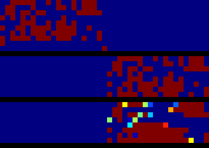

External Memory
===============

Descriptions
------------
various external memory network implementation using tensorflow

Neural Turing Machine(NTM)
--------------------------

* Copy Task Results after 128x20000 ramdom samples(batch_sizexbatch_num)

|
_
|
_

Differentiable Neural Computer(DNC)
-----------------------------------

Sparse Access Memory(SAM)
-------------------------
